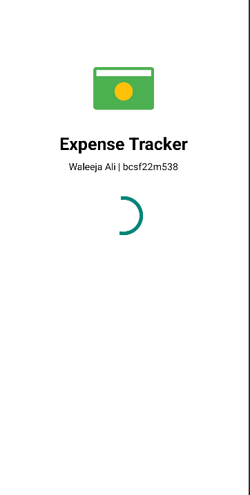
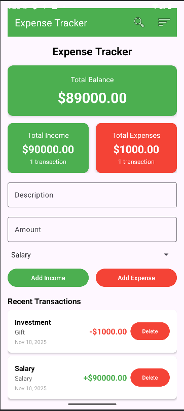
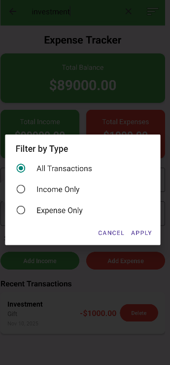
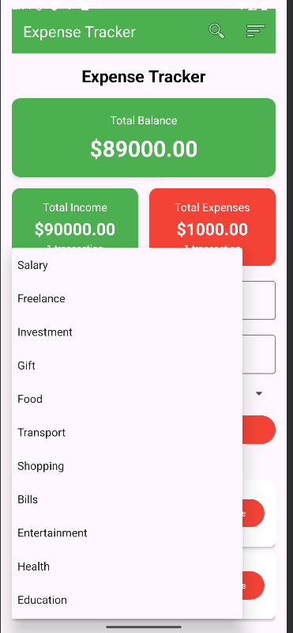

#  Expense Tracker App


A **modern, intuitive Android Expense Tracker** built in **Kotlin** to help you manage your income and expenses effortlessly. Track your transactions, categorize them, view summaries, and analyze your spending — all in a clean Material Design interface.  

---

## 📱 Features

- **Add Income & Expenses**: Record all your transactions with description, amount, and category.  
- **Category Selection**: 12+ categories for income and expenses (e.g., Salary, Food, Transport, Bills).  
- **Data Persistence**: Transactions are saved using **SharedPreferences** with **Gson**, so no data is lost on app restart.  
- **Search & Filter**: Quickly find transactions or filter by **Income**, **Expense**, or **All**.  
- **Income vs Expense Summary**: Dynamic cards showing **total income**, **total expenses**, and the number of transactions.  
- **Delete Transactions**: Remove unwanted transactions easily.  
- **Splash Screen**: Professional splash screen with app logo and name.  
- **Material Design UI**: Clean, responsive layouts compatible with phones and tablets.  
- **Input Validation & Error Handling**: Prevents invalid inputs and handles edge cases gracefully.  

---

## 🛠 Tech Stack

- **Language**: Kotlin  
- **Platform**: Android  
- **IDE**: Android Studio  
- **UI/UX**: XML + Material Design  
- **Persistence**: SharedPreferences + Gson  
- **RecyclerView & Adapters**: Display transaction lists dynamically  

---

## 📸 Screenshots

| Splash Screen  | Home Screen | Filter Function | Category Selection  |
|------------|------------|----------------|-------------------------|
|  |  |  |  |

---

## 🚀 Getting Started

### **Clone & Run**
1. Open the project in **Android Studio**
2. Let Gradle sync
3. Build & run the app on an emulator or physical Android device

---

## 📦 Dependencies

```gradle
dependencies {
    implementation 'androidx.recyclerview:recyclerview:1.3.2'
    implementation 'androidx.cardview:cardview:1.0.0'
    implementation 'com.google.android.material:material:1.11.0'
    implementation 'com.google.code.gson:gson:2.10.1'
}
